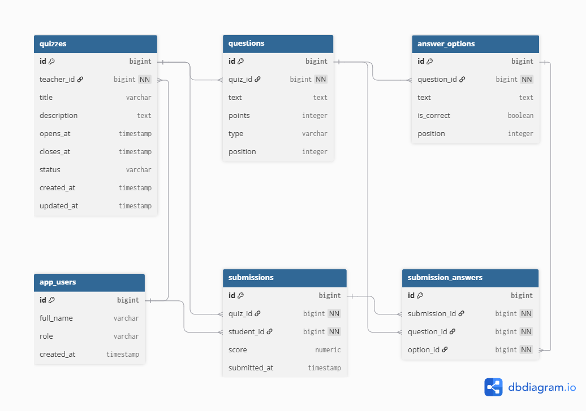

\## ER dijagram baze


<p align="center">

&#x20; 

</p>


\### Objašnjenje modela


Tabela `app\_users` čuva demo korisnike sistema. Korisnik može imati ulogu `TEACHER` ili `STUDENT`.


Tabela `quizzes` predstavlja kviz. Svaki kviz pripada jednom nastavniku preko kolone `teacher\_id`. Kviz ima vremenski prozor definisan kolonama `opens\_at` i `closes\_at`, kao i status `DRAFT` ili `PUBLISHED`.


Tabela `questions` čuva pitanja za kviz. Jedan kviz može imati više pitanja. Svako pitanje ima tekst, broj poena, tip pitanja i poziciju u kvizu.


Tabela `answer\_options` čuva ponuđene odgovore za svako pitanje. Polje `is\_correct` označava da li je opcija tačna. Ovo polje se koristi samo na backend-u za ocenjivanje i ne vraća se studentu kroz API.


Tabela `submissions` predstavlja jednu studentsku predaju kviza. Svaka predaja pripada jednom studentu i jednom kvizu. Rezultat se čuva u koloni `score`.


Tabela `submission\_answers` čuva pojedinačne izabrane opcije u okviru jedne predaje. Na ovaj način se može rekonstruisati koje opcije je student izabrao za svako pitanje.


\### Ograničenje jedne predaje


Na tabeli `submissions` postoji unique constraint nad kolonama:


```sql

UNIQUE (quiz\_id, student\_id)

